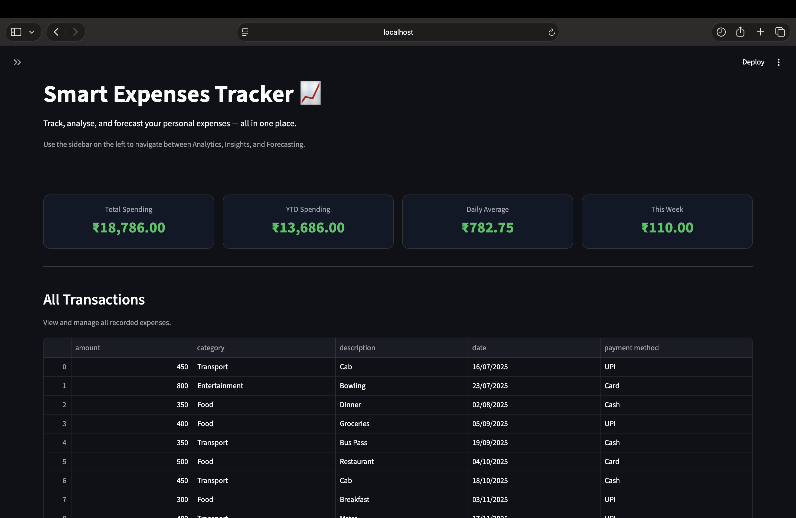
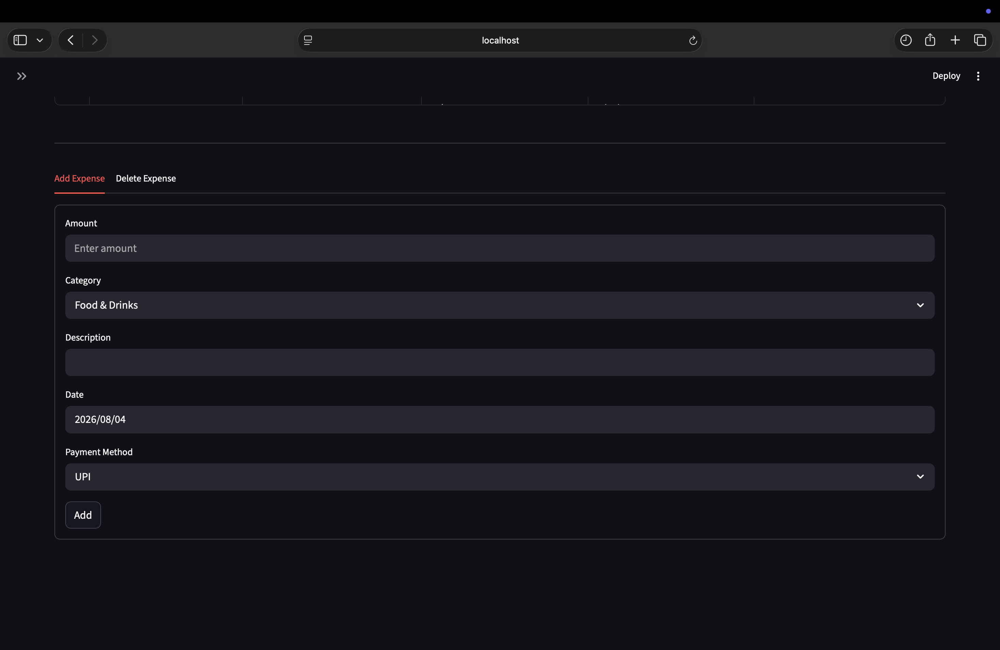
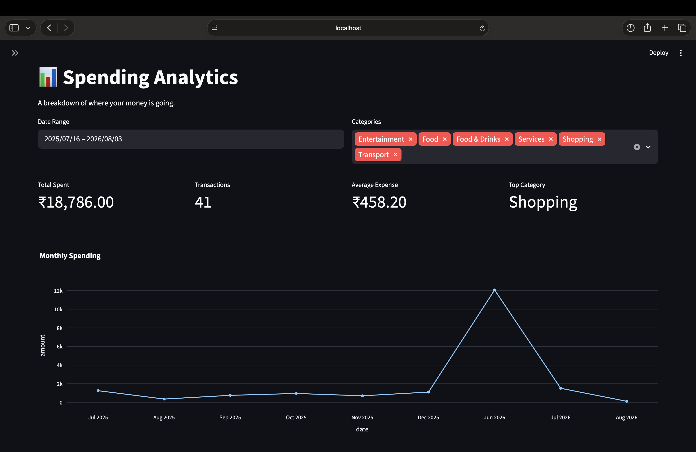
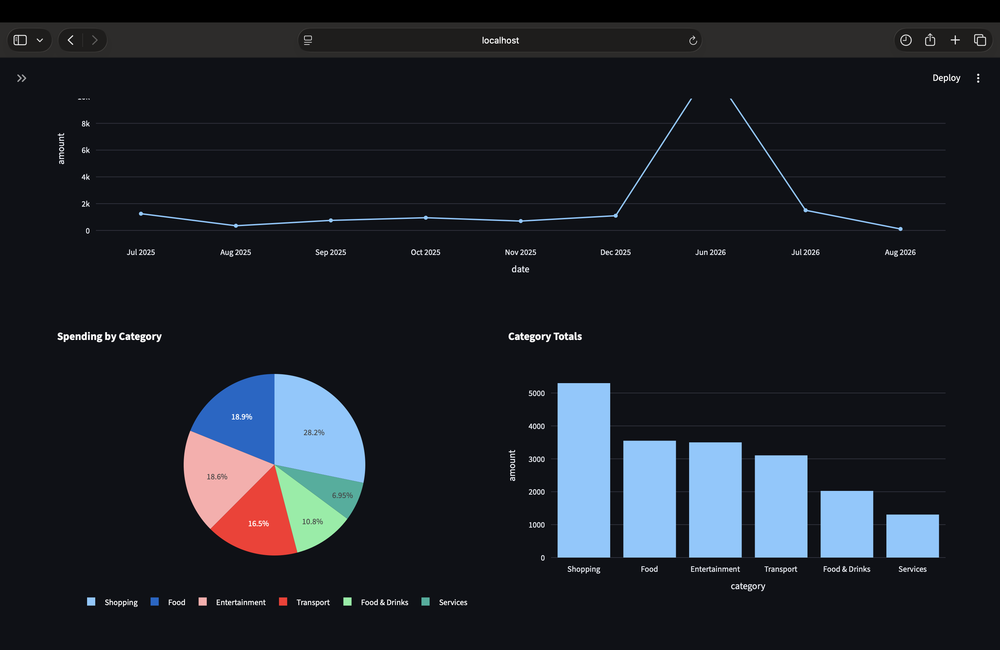
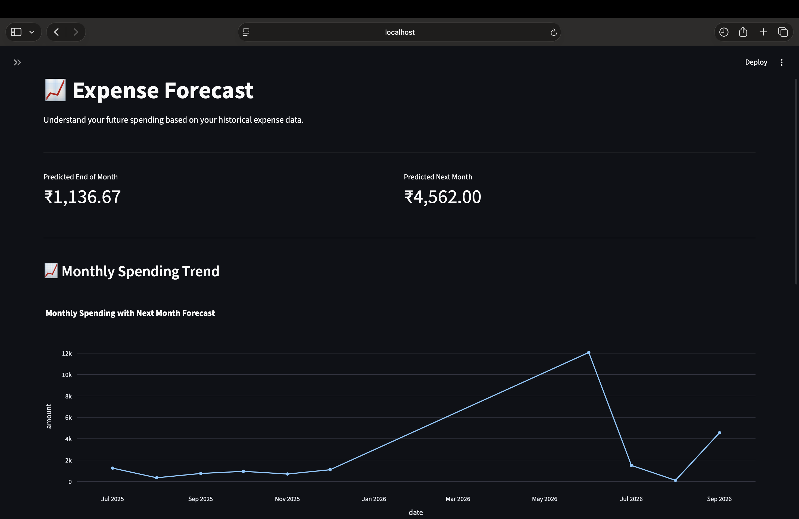
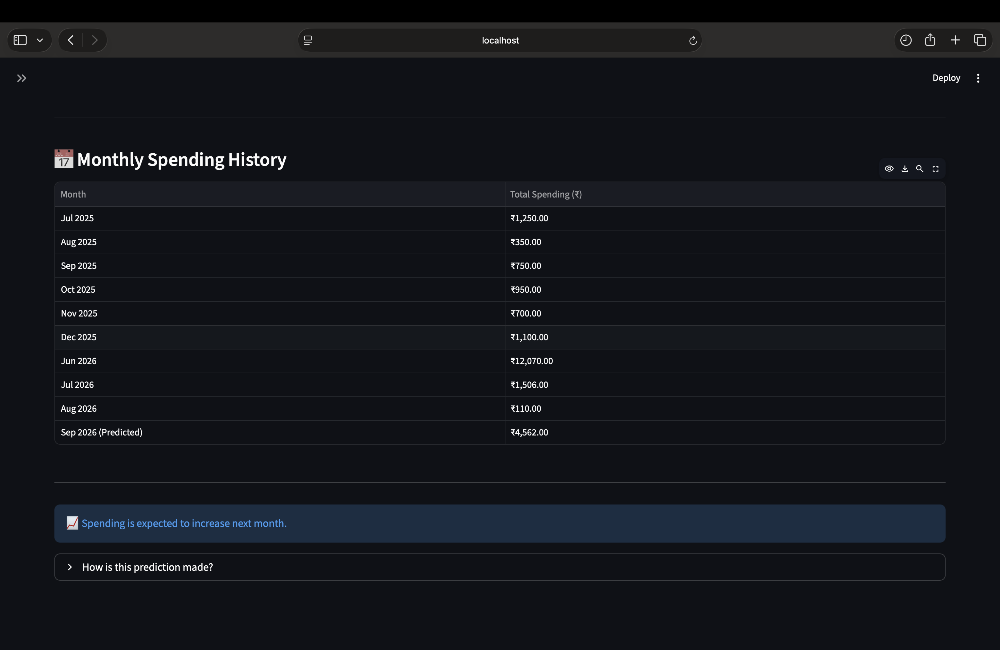
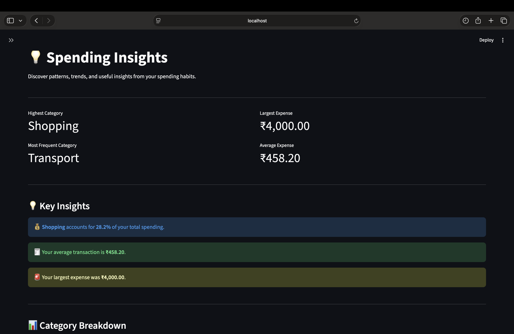
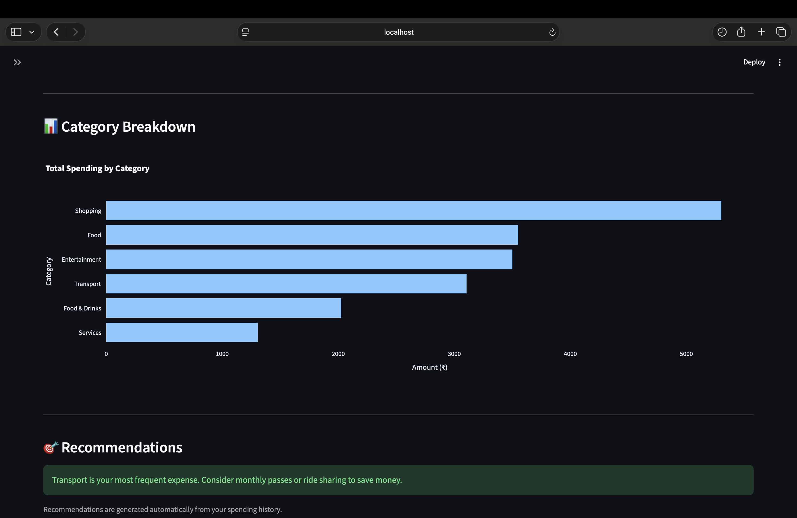

# Smart Expense Tracker

A modern personal finance dashboard built with **Python, Streamlit, Pandas, and Plotly**. The application helps users record expenses, visualize spending patterns, forecast future expenses, and generate personalized financial insights through an intuitive and interactive interface.

---

## Features

### Dashboard Overview
- Add and delete expenses
- View all recorded transactions
- Real-time expense management
- Clean and responsive interface

### Spending Analytics
- Total spending overview
- Transaction count
- Average expense
- Highest spending category
- Monthly spending trend
- Spending by category (Pie Chart)
- Category totals (Bar Chart)
- Date range and category filters

### Expense Forecasting
- End-of-month expense prediction
- Next-month expense prediction
- Monthly spending forecast graph
- Historical monthly spending table
- Forecast explanation
- Automatic spending trend analysis

### Spending Insights
- Highest spending category
- Largest transaction
- Most frequent category
- Average transaction value
- Category breakdown chart
- Automatic financial recommendations
- Personalized spending insights

---

## Tech Stack

- Python
- Streamlit
- Pandas
- Plotly Express

---

## Project Structure

```
smart_expense_tracker/
│
├── overview.py
├── expenses.csv
├── requirements.txt
│
├── pages/
│   ├── analytics.py
│   ├── forecast.py
│   └── insights_ui.py
│
├── analyzer.py
├── predictor.py
├── expense_manager.py
│
└── README.md
```

---

## Installation

Clone the repository

```bash
git clone https://github.com/jshahh2910/smart-expense-tracker.git
```

Navigate to the project directory

```bash
cd smart-expense-tracker
```

Install the required packages

```bash
pip install -r requirements.txt
```

Run the application

```bash
streamlit run overview.py
```

---

## Screenshots

### Dashboard Overview




### Analytics




### Forecast




### Insights




---

## Forecasting

The forecasting module estimates future spending using historical monthly expense data. It provides:

- Predicted end-of-month spending
- Predicted next-month spending
- Monthly spending forecast visualization
- Spending trend interpretation

---

## Key Highlights

- Interactive Streamlit dashboard
- Real-time KPI metrics
- Dynamic filtering
- Interactive Plotly visualizations
- Expense forecasting
- Automated spending insights
- Clean and modular project architecture

---

## Future Improvements

- SQLite database integration
- User authentication
- Monthly budget planning
- Savings goal tracking
- Export reports (CSV/PDF)
- Dark mode
- Multi-user support
- Improved forecasting models

---

## Author

**Jash Milan Shah**

Computer Science (AI & ML) Student

---

## License

This project is licensed under the MIT License.